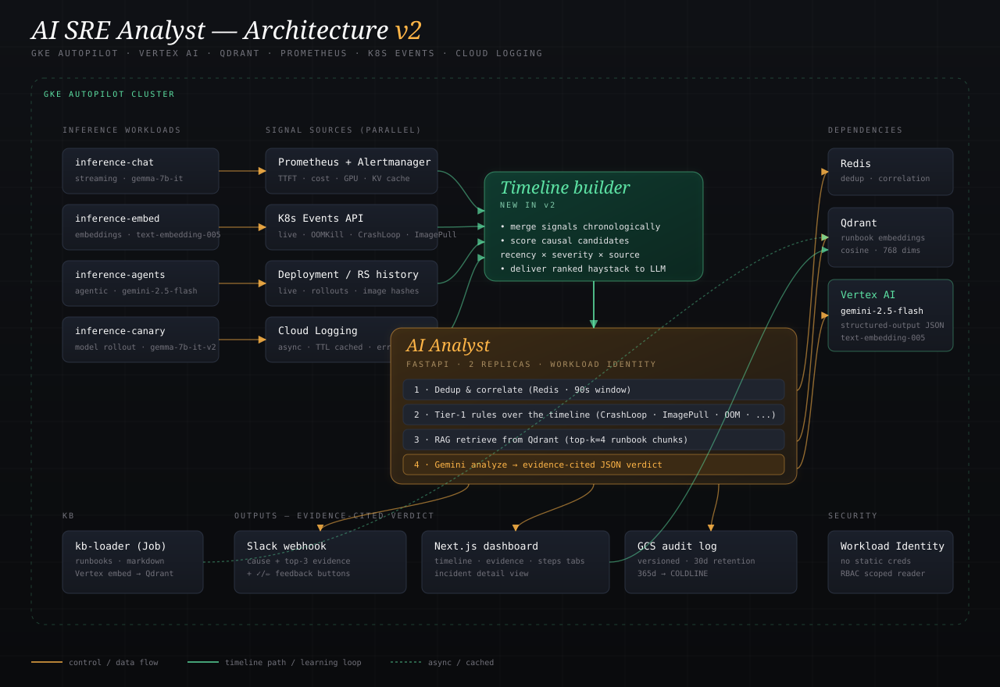

# AI SRE Analyst

> An AI that watches your AI. Autonomous incident triage for LLM serving infrastructure on Kubernetes — built on GKE Autopilot with Vertex AI Gemini 2.5 Flash, RAG over operational runbooks, and a closed-loop feedback path that learns from SRE corrections.



## What's new in v2.1 (production hygiene)

v2 made the analyst investigate. v2.1 makes it production-ready.

- **Severity-tiered LLM dispatch.** The cost guard decides per alert: P3 → deterministic summary (no LLM call), P2 → Gemini Flash without RAG, P1 → full RAG + Flash. A daily token budget is tracked in Redis; soft limit (80%) degrades P2 to summary-only, hard limit (100%) degrades P1 too. Better to ship a deterministic verdict than throw 503s.
- **Durable incident store.** Verdicts persist to Firestore — incident ID, all verdict versions, timeline at verdict time, feedback log, status. Indexed for the dashboard's open-incidents view. Redis stays cache-only. Local dev mode (`INCIDENT_STORE=memory`) skips Firestore for testing without GCP credentials.
- **Curated feedback loop.** SRE corrections no longer auto-embed into Qdrant. They land in a `pending_lessons` queue, get reviewed, and only approved lessons enter the KB — tagged with `source: feedback-loop:approved` and provenance fields (`submitted_by`, `approved_by`). Endpoints: `GET /v1/lessons`, `POST /v1/lessons/{id}/approve`, `POST /v1/lessons/{id}/reject`.
- **NetworkPolicy + least-privilege RBAC.** The analyst pod's K8s reads are scoped per-namespace via RoleBindings (no cluster-wide read). NetworkPolicy pins ingress to monitoring/dashboard pods and egress to Redis/Qdrant/DNS/K8s API/HTTPS. Default-deny for everything else in the namespace.

## What's new in v2

v1 summarized alerts. v2 investigates incidents.

The analyst now builds a per-incident **timeline** by merging Kubernetes Events, recent Deployments, error logs, and the firing alert into one chronological narrative. The LLM reasons about that narrative instead of an isolated alert, and every verdict cites the specific timeline events that drove its conclusion. "Memory limit too low" is no longer a vibe — it's a claim backed by an OOMKilling event at 18:42 and a Deployment rolled at 18:30.

Concrete changes from v1:
- **Multi-source signal collection.** K8s Events API + Deployment/ReplicaSet history (live, ~100ms) + Cloud Logging (TTL-cached, async). All three run in parallel per incident.
- **Incident timeline builder** — sorts events chronologically, scores each pre-alert event by causal plausibility (recency × severity × source weight), and hands the LLM a ranked haystack.
- **Evidence-cited verdict schema** — `probable_cause`, `confidence`, `evidence: [{source, ts, observation, weight}]`, `recommended_action`. The Gemini system prompt requires citations from the timeline; hallucinated causes are out by construction.
- **Expanded tier-1 rules** — CrashLoopBackOff, ImagePullBackOff, FailedScheduling, plus the original OOMKilled and CertificateExpiry. All driven by K8s Events, not just alert fingerprints.
- **Dashboard incident detail view** — three tabs per incident: Evidence, Timeline (with causal-candidate scores), and Remediation steps.

LLM serving has its own failure modes — TTFT degradation under KV-cache pressure, output token explosions from agent loops, GPU memory leaks across canary rollouts — and these don't show up cleanly on a generic SRE dashboard. This project is a working, demoable system that watches four heterogeneous inference workloads, deduplicates and correlates alerts, retrieves relevant runbook context from a vector store, asks Gemini for a structured root-cause hypothesis, and posts the verdict to Slack and a live dashboard. SRE corrections feed back into the vector store so the system gets sharper over time.

The four workloads are deliberately different — chat, embeddings, agents, and a canary model release — because real AI infra is heterogeneous, and the cross-workload cascade story (a canary rollout breaks chat, retries cascade into agents) is exactly the failure mode where AI-aware tooling pays for itself.

---

## What it does

When a Prometheus alert fires for an inference workload:

1. **Dedup** — identical alert fingerprints are suppressed for 5 minutes via Redis. A KV-cache saturation event that fires every 30 seconds gets one verdict, not fifty.
2. **Correlate** — every alert is also recorded in a sliding 90-second window. The analyst sees what else is on fire across workloads before forming a hypothesis. This is how cross-namespace cascades (canary → chat → agents) get caught.
3. **Build the incident timeline.** This is the core of v2. The analyst calls three signal collectors in parallel — Kubernetes Events, recent Deployment/ReplicaSet rollouts, and Cloud Logging error entries — and merges them with the alert into one chronological narrative. Causal candidates (anything before the alert) are scored by recency, severity, and source, so the LLM sees a ranked haystack instead of a wall of context.
4. **Tier-1 rules** — deterministic checks now run over the *timeline*, not just the alert fingerprint. CrashLoopBackOff, ImagePullBackOff, FailedScheduling, OOMKilling — all caught from K8s Events without an LLM call. When a tier-1 rule fires alongside a recent deploy, the verdict cites both.
5. **RAG** — for everything else, the alert query is embedded with Vertex AI `text-embedding-005` and matched against runbook chunks in Qdrant. Top-k=4.
6. **Gemini** — a structured prompt (alert + ranked causal candidates + runbook excerpts) goes to `gemini-2.5-flash` with a JSON response schema. The schema requires every claim in `probable_cause` to be backed by a specific entry in the `evidence` array — citing either a timeline event or a runbook title. The model cannot invent evidence that isn't in the context.
7. **Fan-out** — the verdict (probable cause + confidence + evidence + recommended action + remediation steps + full timeline) goes to Slack, the Next.js dashboard, and an append-only GCS audit bucket. SRE corrections are embedded back into Qdrant — that's the closed loop.

Each verdict carries a confidence score, a blast-radius list, ordered remediation steps, and *cited* evidence rows linking back to the specific timeline events that drove the conclusion.

---

## AI-native signals it watches

These metrics are emitted by the mock inference services and aren't typically in a generic SRE dashboard:

| Metric | What it catches |
|---|---|
| `inference_time_to_first_token_seconds` | Streaming UX degradation; users notice 800ms+ TTFT as "frozen" |
| `inference_tokens_out_total` | Cost runaways — output growing faster than RPS = agent loop |
| `inference_cost_usd_total` | Synthesized cost; alerts when burn rate exceeds 2× baseline |
| `gpu_memory_pressure_ratio` | Lead indicator for CUDA OOM, before the pod actually OOMs |
| `kv_cache_usage_ratio` | KV cache saturation — the most common TTFT root cause |
| `inference_inflight` | Backpressure signal; queueing for batched decode |

Standard `inference_requests_total{status}` and `inference_latency_seconds` are also there so generic SRE alerts still fire correctly.

---

## Tech stack

| Layer | Choice | Why |
|---|---|---|
| Compute | GKE Autopilot | No node management, pay per pod, fits portfolio budget |
| LLM | Vertex AI · `gemini-2.5-flash` | GCP-native, low latency, structured output |
| Embeddings | Vertex AI · `text-embedding-005` | Same auth surface as Gemini |
| Vector store | Qdrant (self-hosted on GKE) | Demonstrates real stateful AI infra; no managed-service hand-waving |
| Cache | Redis | Dedup TTL keys + sliding-window correlation ZSET |
| Telemetry | Prometheus + Alertmanager | Industry-standard, the baseline AI-infra teams already run |
| Dashboard | Next.js 15 + Tailwind + Recharts | Server-rendered, looks polished in screenshots |
| Service | FastAPI (Python 3.12) | Async-first, Pydantic models, `/metrics` for self-observability |
| Deploy | Helm chart + Terraform | One command to provision; one to install |
| Identity | Workload Identity (GKE → IAM) | No static credentials in pods |
| Audit | GCS, versioned, retention-locked | Compliant audit trail for AI-driven actions |

---

## Quick start

```bash
# 1. authenticate to a GCP project where you have Owner
gcloud auth application-default login

# 2. one shot — provisions GKE Autopilot + Artifact Registry + audit bucket,
#    builds and pushes images, installs Prometheus, installs the chart,
#    and seeds the runbook KB
PROJECT_ID=my-gcp-project ./scripts/deploy.sh
```

That gets you a running cluster with four mock inference workloads, three of which will start scripted incidents three minutes after they boot. Watch verdicts arrive in Slack and on the dashboard.

To run the dashboard locally against the deployed analyst:

```bash
cd services/dashboard
npm install
npm run dev   # http://localhost:3000
```

---

## Repo layout

```
services/
  ai-analyst/
    app/
      main.py             # FastAPI webhook → dedup → timeline → tier-1 → RAG → Gemini → fan-out
      models.py           # Pydantic — Alert, IncidentTimeline, Evidence, AnalysisResult
      timeline.py         # Merges signals into a ranked, time-sorted incident timeline
      analyzer.py         # Tier-1 timeline-aware rules + tier-3 Gemini with evidence schema
      signals/            # K8s Events (live), Deployments (live), Cloud Logging (cached)
      dedup.py            # Redis dedup + 90s correlation window
      vectorstore.py      # Qdrant RAG over runbooks
      notifier.py         # Slack blocks (probable cause + top-3 evidence + steps)
      audit.py            # Append-only GCS audit log
  mock-inference-svc/     # Synthetic LLM workload with scriptable AI failure modes
  kb-loader/              # Embeds runbook markdown into Qdrant via Vertex AI
  dashboard/              # Next.js 15 mission-control UI w/ timeline + evidence tabs
deploy/
  helm/ai-sre-analyst/    # Chart: analyst + deps + mocks + rules + AM config + RBAC
  terraform/              # GKE Autopilot, Artifact Registry, GCS audit, Workload Identity
knowledge-base/
  runbooks/               # AI-infra runbooks: TTFT, cost runaway, GPU OOM, AI cascade
docs/
  architecture.svg        # The diagram at the top of this README
  linkedin-post.md        # Post variants for the portfolio writeup
  demo.md                 # What to show on a screen recording
scripts/
  deploy.sh               # One-shot deploy
```

---

## Demo scenarios

The chart wires three of the four workloads to misbehave on schedule. After the helm install settles, give it ~3 minutes:

| Workload | Mode | What you'll see |
|---|---|---|
| `inference-chat` | `ttft_spike` | TTFT climbs from 180ms → 1.84s. KV cache saturates. `InferenceTTFTHigh` fires. AI verdict diagnoses KV cache pressure and recommends reducing `max_concurrent_requests` before scaling. |
| `inference-embed` | `none` | Healthy control. Useful contrast on the dashboard. |
| `inference-agents` | `cost_runaway` | Output token rate jumps to 8× baseline while RPS is unchanged. `InferenceCostSpike` fires. AI cross-references with the recent agents-runtime release, flags it as a likely missing recursion guard, recommends rollback before forward-fix. |
| `inference-canary` | `gpu_pressure` | GPU memory pressure climbs ~0.6%/min. `GPUMemoryPressure` fires. AI catches it in tier-1 rules before CUDA OOM happens. |

Tail the analyst's structured logs to watch the pipeline:

```bash
kubectl -n ai-sre logs -l app.kubernetes.io/name=ai-analyst -f
```

---

## What this project is meant to demonstrate

For a hiring reviewer or LinkedIn reader, the interesting bits are:

- **AI-aware observability, not generic K8s observability.** The metrics, alerts, and runbooks are specific to LLM serving — TTFT, cost burn rate, KV cache, GPU pressure. A generic SRE-tool comparison would miss these signals entirely.
- **GenAI used carefully, not as a hammer.** A tiered analyzer (rules → ML → LLM) means the LLM is only invoked when it adds value. Boring alerts skip it entirely.
- **Structured output, not vibes.** Gemini is asked for a JSON schema response, so the dashboard and Slack consumers are type-safe and the system can fail closed when the model returns malformed output.
- **RAG that's actually useful.** The knowledge base is operational runbooks the team already maintains in Markdown — not a synthetic corpus. The vector store updates on SRE feedback, so the system gets sharper with use.
- **Production hygiene.** Workload Identity (no static creds), structured logging, Prometheus self-metrics, immutable audit log, HPA, non-root containers, read-only root FS.
- **Reproducible demo.** The mock services script their own incidents, so a screen recording or live walkthrough doesn't depend on real traffic patterns.

---

## What I'd build next (Phase 3)

Phase 1 (v1) summarized alerts. Phase 2 (v2/v2.1, this version) investigates with evidence and ships production-hygiene controls. The genuine remaining work:

- **OpenTelemetry traces in the timeline.** Currently the timeline merges K8s Events + Deployments + Cloud Logging. Distributed traces (frontend → orchestrator → embedding → LLM) would catch latency-attribution incidents that none of those sources see. This is the next high-signal source to add.
- **Auto-remediation with human approval.** Split into `AI Analyst` (read-only, today) and `AI Operator` (action-capable). The Operator generates a `kubectl` / `helm` plan, posts to Slack, executes only on `:check:` reaction. Feature-flagged behind an org policy. Read/write isolation is the whole point — analyst credentials never get write scope.
- **Cost-aware routing recommendations.** When `inference-agents` shows cost runaway, suggest concrete `max_tokens` / model-variant / sampling-parameter changes that would land the workload back at baseline. The analyst already has the data; this is a separate verdict shape.
- **Tier-2 ML classifier.** A small model on alert features (severity, source, recent-deploy proximity, correlated-alert count) to short-circuit common patterns even faster than the LLM and cheaper than maintaining tier-1 rules. Shadow-mode first, promote to live after accuracy benchmarks against tier-3.
- **Private Service Connect for Vertex AI / Firestore.** Currently egress to managed services goes over the public API endpoints (NetworkPolicy permits 443 broadly). PSC pins this to a private VPC route. Worth doing before this would face real PII.
- **Multi-cluster federation.** Federate alerts and verdicts across several GKE clusters into one analyst, with cluster as a first-class label on every timeline event.

---

Built as a portfolio piece. Questions, hire-me-please notes, or "you got the prompt wrong here" PRs all welcome.
